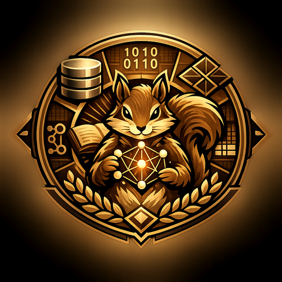

<div class="hero" markdown>

{ width="200" }

# Relational data, without writing the relations by hand

**Squirrel** is a small DSL, embedded directly in Mojo source via `@@`-prefixed
markers, that compiles `.rel` files into plain Mojo. Declare an entity struct
with a relation field, and get the refcounted storage, id allocator, indexes,
and accessor methods for it generated — instead of hand-rolling a table and
forward/backward indexes yourself.

A `.rel` file is otherwise just Mojo. Anything not `@@`-marked passes through
untouched.

Work with simple or complex data in your apps — you'll like this.

[Get started](getting-started.md){ .md-button .md-button--primary }
[Read the DSL guide](dsl-guide.md){ .md-button }

</div>

## Why model data this way

A raw id and a struct field can point at "the same thing" your data model
does, but only a real relation makes that connection something the
compiler and the generated code actually know about:

- **One copy, referenced everywhere it's used.** An entity lives in exactly
  one table row; every relation field pointing at it shares that same row
  rather than duplicating its data. Update it once, and everything
  referencing it sees the update — there's no second copy to forget.
- **The reverse lookup always exists.** Declaring `@@dept: @@Department` on
  `@@Employee` doesn't just let you read an employee's department — it also
  gives `@@Department`'s own side `for_dept(...)`, with no separate index to
  hand-write and keep in sync.
- **References can't dangle.** A relation field is a refcounted
  `EntityHandle`, not a bare id — the target it points at is guaranteed
  live for as long as anything points at it, and a relation graph that
  could never be safely torn down (a cycle) is rejected before you can
  even compile, not discovered at runtime.
- **The schema grows without disturbing what's already there.** Adding a
  new relationship between two existing structs — even a self-relation,
  via a join struct — never means restructuring how either one stores its
  own fields.
- **Constraints are declared once, not re-checked by hand everywhere.**
  `unique`, cardinality (one-to-many vs. `multi`'s many-to-many), and
  acyclicity are structural properties of the schema, enforced the same
  way for every caller — not application-code discipline that's easy to
  get right once and forget somewhere else.

## One field instead of a hand-rolled index

<div class="grid" markdown>

<div markdown>

```
@@struct @@Department:
    name: String

@@struct @@Employee:
    unique email: String
    title: String
    @@dept: @@Department
```

That's the whole schema: a unique-constrained field, and a relation with a
generated reverse lookup — no id allocator, no forward/backward `Dict`, no
manual refcounting to get right.

</div>

<div markdown>

```
def main() raises:
    @@{
        var @@eng = @@Department { .name = "Engineering" }
        var @@alice = @@Employee {
            .email = "alice@co.com",
            .title = "Engineer",
            .@@dept = @@eng,
        }

        for @@e in @@Employee.for_dept(@@eng):
            print(@@e.title)
    @@}
```

`for_dept` — the reverse lookup — didn't need declaring. It comes free with
the `@@dept: @@Department` field above.

</div>

</div>

## What you get per `@@struct`

<div class="grid cards" markdown>

-   :material-table:{ .lg .middle } **Generated storage**

    ---

    An id allocator, refcounted `EntityHandle`s, and one `Rel`/`UniqueRel`/
    `ForwardOnlyRel`/`MultiRel` per field — whichever modifier that field
    uses selects the right one.

-   :material-arrow-left-right-bold:{ .lg .middle } **Accessors, both directions**

    ---

    `create`/`get_<field>`/`set_<field>`/`for_<field>` per field, generated
    from the schema — including the reverse lookup a relation field implies.

-   :material-shield-check:{ .lg .middle } **Constraints that are actually enforced**

    ---

    `unique` raises on a duplicate at construction time, not at some later
    query. A relation cycle across your whole schema is rejected before you
    can even compile, since Mojo's `ArcPointer` has no cycle collector.

-   :material-code-json:{ .lg .middle } **Whole-world JSON, for free**

    ---

    Dump every table's every live entity to JSON and reconstruct it later,
    ids and all — reconstruction happens in dependency order, so a relation
    field always resolves to an already-live target.

</div>

## Field modifiers, one keyword each

| keyword       | what it buys you                                                                 |
| ------------- | ---------------------------------------------------------------------------------|
| `unique`      | at most one entity may hold a given value — `for_<field>` returns the one match, or raises |
| `forwardonly` | skip the reverse index entirely — for a type that isn't hashable, or a lookup you'll never need |
| `multi`       | a real many-to-many relation, declared on one side only — `add_to_<field>`/`remove_from_<field>`/`for_<field>` come free on both |
| `ordered`     | a sorted index alongside the field, for range queries (`_greater_than`, `_between`, ...) a hash index can't answer quickly |

## No hidden runtime, no hand-threaded state — until you want it

Every `@@`-marked construct is sugar over a single, ordinary Mojo value:
`sqrrl__world`. `@@{`/`@@}` bring it into scope once; every
`@@`-marked function after that just threads it through automatically. When
the sugar doesn't reach — a library function you'd rather write in real Mojo,
a boundary outside any `.rel` file — you can thread `sqrrl__world` by hand
instead. See [Advanced features](advanced-features.md).

<div class="hero hero--footer" markdown>

Compile a whole project with one command, run it like any other Mojo
program:

```sh
pixi run run examples/kitchen_sink
pixi run mojo run -I examples/kitchen_sink examples/kitchen_sink/main.mojo
```

[Get started](getting-started.md){ .md-button .md-button--primary }
[:material-heart: Sponsor](https://github.com/sponsors/kt-734){ .md-button }

</div>
